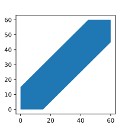

# Основные типы вероятностных пространств

## 1. Дискретное вероятностное пространство

\\( {\Omega, \mathcal{F}, P} \\) называются дискретным вероятностным пространством, если
1. \\( \Omega \\) - не более чем счётное
2. \\( \mathcal{F} \\) - множество всех подмножеств \\( \Omega \\)
3. \\( \forall A \in \mathcal{F} \quad P(A) = \sum_{\omega_i \in A} P(\omega_i) \\)

Частный случай - классическое пространство: \\( \Omega = \\{ \omega_1, \ldots, \omega_n \\} \\) - конечное, \\( P(\omega_i) = \frac{1}{n} \\).

## 2. Геометрическое определение вероятности

Если исходов более чем счётное множество, то дискретное вероятностное пространство не подходит.

Пусть существует некоторая область D в \\( \mathbb{R}^n \\). Бросим точку в эту область. Тогда вероятность попадания P точки в область G \\( (G \subset D) \\) будет равна
\\[ P = \dfrac{\mu(G)}{\mu(D)} \\]
где \\( \mu(G) \\) - мера Лебега множества G

[//]: # (TODO: Описать меру Лебега)

\\[ \mu(G) = \int_G \mathrm{d} x \qquad \mu(D) = \int_D \mathrm{d} x \\]

При таком определении предполагается, что никакие части D не является более предпочтительное для попадания.

### Задача о встрече

> Два человека договорились встретиться с полудня до часу дня, но забыли в какое точное время. Пришедший первым ждёт другого 15 минут. Чему равна вероятность, что они встретятся?

Для того чтобы они встретились необходимо, чтобы разница между временем, когда пришёл первый, и когда пришёл второй, была меньше 15 минут. Если представить это в виде графика, оси x и y которого будут соответствовать времени, когда пришёл первый и второй соответственно, то получим следующее:

Синим помечена область, когда они встретятся друг с другом. Если представить событие, как пару чисел (x, y), где x - время, когда пришёл первый, а y - когда пришёл второй, то задачу можно свести к вероятности попадания точки (x, y) в синюю область. Тогда вероятность будет равна
\\[ P = \dfrac{\mu(\text{синяя область})}{\mu(\text{вся область})} = \dfrac{3600 - 45 \cdot 45}{3600} = \dfrac{1575}{3600} = \dfrac{7}{16} \\]

## Статическое определение вероятности

Предположим, проводится серия одинаковых испытаний. Исходы между собой не связаны. Каждый раз фиксируется, произошло ли некоторое событие A. Всего n испытаний. \\( n_A \\) - число испытаний, в которых имеет место событие A: \\( 0 \le n_A \le n \\).

Далее серии испытаний по возможности повторяются с увеличение n. Если есть основание, что \\( \lim_{n \to \infty} \frac{n_A}{n} = P\\), то P - статическая вероятность события A.